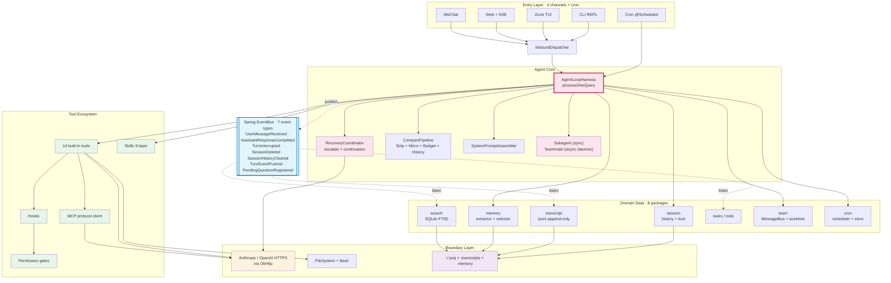

# jooj — A Claude-Code-Style Agent Runtime, in Java

> An extensible AI agent harness written in Java. Direct Anthropic protocol over OkHttp, wired with Spring Boot 4, running across four surfaces (CLI · TUI · Web · WeChat) plus a cron scheduler. Bring your own key.


[中文 README](./README.zh.md) · [Architecture deep-dive](./EVOLUTION.md)

---

## TL;DR

Most agent runtimes today are Python. **jooj is what happens when you build one seriously in Java** — with 1160+ tests, 25 top-level packages by feature domain, and every component (`@Component`) auto-wired by Spring. It talks to Claude / Anthropic-compatible providers over raw HTTP, hosts an ecosystem of built-in tools plus MCP servers plus Claude-Code-style Skills, and exposes the same agent loop through a REPL, a JLine TUI, a web UI, WeChat, and a cron-triggered background lane.

If you've been reading Claude Code / Codex / Aider source code and wondering *"what would this look like as a proper JVM app I could embed in a real product?"* — this is that experiment.

```
    User  ─┐
    Web   ─┤
    TUI   ─┼── InboundDispatcher ──▶ AgentLoopHarness.processOneQuery(sid, q)
    Cron  ─┤                              │
    WeChat─┘                              ├── Tools (14 built-in + MCP + Skills)
                                          ├── Compact / Memory / Transcript
                                          ├── Subagent (sync) / Teammate (async daemon)
                                          └── Anthropic HTTP over OkHttp
```

---

## Why you might care

- **You want to learn how an agent runtime actually works.** Recovery, compaction, memory, hooks, permission gates, MCP transport, skill loading, subagents — every piece is a small, testable class you can read in a sitting.
- **You want Python-free.** Long-running JVM process, no venv rot, boring deployment (`java -jar`), first-class thread pools, real IDE support.
- **You want to embed an agent inside a Spring service.** Because it *is* a Spring service. Every subsystem is a `@Component`; you compose new tools, hooks, or channels by adding a class.
- **You want to inspect the wire.** No official SDK, just an OkHttp client and typed DTOs — `logging.level.com.xilidou.jooj.http=DEBUG` prints every request/response.

---

## Feature Highlights

- **Multi-turn Agent Loop** with error recovery (`RecoveryCoordinator` handles escalate / continuation / fatal internally, throws a checked `FatalRecoveryException` for the loop to catch)
- **14 built-in tools** — `bash` · `read_file` · `write_file` · `edit_file` · `glob` · `todo_write` · `task_*` · `cron_schedule` · `team_message` · `worktree_*` · `mcp_manage` · `mcp_proxy` · `session_search` · `ask_user_question`
- **MCP protocol client** — call `connect_mcp("filesystem")` at runtime, all remote tools instantly available as `mcp__filesystem__read` etc. Stdio and mock transports.
- **Skills system**, three-layer with override priority: `<project>/skills/` → `~/.jooj/skills/` → `~/.claude/skills/`. Compatible with [vercel-labs/skills](https://github.com/vercel-labs/skills) CLI ecosystem.
- **Persistent Memory** — an LLM-driven extractor pulls durable facts (preferences, project state, references) after each turn; the selector re-injects only what's relevant on the next turn. Indexed with SQLite FTS5.
- **Event-driven Transcript** — the harness publishes `UserMessageReceived` / `AssistantResponseCompleted` / `TurnInterrupted` / `SessionDeleted` / `SessionHistoryCleared` on Spring's `ApplicationEventPublisher`; independent listeners write jsonl transcripts, update FTS, clear todos. History and transcript are two separate concerns.
- **Two subagent models**
  - **Subagent** (synchronous): spawn, block, return summary — shares hooks / registry
  - **Teammate** (async daemon): long-lived, independent inbox, `MessageBus` routing, `git worktree` isolation
- **Context compaction pipeline** — four layers (Snip · Micro · Budget · History) applied proactively based on token budget
- **Slash commands** — `/clear` · `/sessions` · plus custom `SlashCommand impl + @Component`
- **Permission pipeline** — deny-list → rule-based → user approval, all pluggable
- **1164 tests, ~8 seconds** — including several `@SpringBootTest` integration cases

---

## Quick Start

```bash
git clone https://github.com/YOUR_USERNAME/jooj.git && cd jooj
./mvnw -DskipTests=true package

# Launch the Web UI (default port 8080)
java -jar target/jooj-0.0.1-SNAPSHOT.jar --web

# ...or the TUI (JLine-based)
java -jar target/jooj-0.0.1-SNAPSHOT.jar --tui

# ...or plain CLI REPL
java -jar target/jooj-0.0.1-SNAPSHOT.jar
```

**First launch** creates `~/.jooj/.env` (mode 0600) with a template. Open it and drop in one of:

```env
# Path 1 — Anthropic direct
ANTHROPIC_API_KEY=sk-ant-...
MODEL_ID=claude-sonnet-4-5

# Path 2 — any Anthropic-compatible proxy (LLM gateway, DeepSeek, self-hosted)
ANTHROPIC_AUTH_TOKEN=your-token
ANTHROPIC_BASE_URL=https://your-proxy.example.com
MODEL_ID=your-model-id
```

Environment variables override the `.env` file, so `export ANTHROPIC_API_KEY=...` works too.

### Entry points

| Mode | Command | Best for |
|---|---|---|
| **Web** | `java -jar ... --web` → http://localhost:8080 | Browser chat with sidebar showing skills / memory / status |
| **TUI** | `java -jar ... --tui` | Rich terminal experience with live turn events |
| **CLI** | `java -jar ...` | Plain REPL, scriptable |
| **WeChat** | Configure `jooj.weixin.*` → `WeixinController` | Passive replies on WeChat Official Accounts |
| **Cron** | `cron_schedule` tool or `~/.jooj/cron/scheduled_tasks.json` | Background scheduled agent runs, durable across restarts |

---

## Architecture at a glance

25 top-level packages, flat by feature domain (no deep nesting). Grouped into five clusters plus a Spring event bus:



**Key runtime patterns:**

- **Dependency injection + event bus** — the harness holds 17 collaborators via constructor injection, but domain-to-domain communication (transcript, search, todo cleanup) goes through Spring's `ApplicationEventPublisher`. That way transcripts are decoupled from the loop.
- **Every channel funnels into one method** — `AgentLoopHarness.processOneQuery(sid, query, hint)`. Memory prefetch, `drainLeadInbox` (pull teammate messages), and `ExecutionContext` line up automatically.
- **Recovery internalised** — `RecoveryCoordinator.call()` loops on `escalate` / `continuation` internally and only throws `FatalRecoveryException` (checked) to the outer loop. No leaky sealed-type dispatch.

See [Jooj项目_架构图.md](./EVOLUTION.md) for full mermaid diagrams, decision history (D1–D18), and the extension-point cheat sheet.

---

## Extending jooj

| I want to add… | I write… | I don't touch |
|---|---|---|
| A new **tool** (e.g. `git_diff`) | `XxxTool implements Tool` + `@Component` in `tool/impl/` | `ToolRegistry`, `AgentLoopHarness` |
| A new **hook** (e.g. rate-limiter) | `Hook.OnPreToolUse` + `@Component` in `hook/impl/` | `HookManager` |
| A new **channel** (Discord, Slack) | `MessageChannel + @Component` + matching `AnswerPresenter` | `InboundDispatcher`, harness |
| A new **event type** | Add to `TranscriptEvent sealed` permits + `@EventListener` methods | Harness (unless it's a new publish site) |
| A new **MCP server** | One line in `application.yml` under `jooj.mcp.servers.*` | Any Java |
| A new **skill** | Drop a markdown file with frontmatter into `skills/` | `SkillRegistry` (auto-scans) |
| A new **slash command** | `SlashCommand impl + @Component` in `slashcmd/impl/` | Harness |
| A new **permission rule** | Edit `jooj.permission.mode` in yml — or write a `PermissionGate` bean | Harness |
| Switching **LLM backend** (OpenAI etc.) | Implement `AnthropicClient` interface, swap the `@Bean` in `HttpClientConfiguration` | Any core code |

The auto-wiring means you almost never touch the loop itself. That's the point.

---

## MCP integration

jooj embeds the official Java [Model Context Protocol](https://modelcontextprotocol.io) SDK 2.0.0. Configure servers in `application.yml`:

```yaml
jooj:
  mcp:
    servers:
      filesystem:
        command: npx
        args: ["-y", "@modelcontextprotocol/server-filesystem", "/Users/me/projects"]
      git:
        command: npx
        args: ["-y", "@modelcontextprotocol/server-git", "--repo", "."]
```

At runtime, the LLM can call `connect_mcp("filesystem")` — jooj spawns the stdio subprocess, discovers its tools, and exposes them as `mcp__filesystem__read` etc. Unknown server names fall back to an internal mock (handy for demos).

---

## REST API (Web mode)

Chat (`ChatController`):

| Endpoint | Purpose |
|---|---|
| `POST /api/chat` | Send a query, run one loop turn, return `{reply, historySize, toolCalls}` |
| `GET /api/history` | Full flat history (role + text) |
| `POST /api/clear` | Clear session history |

Sidebar (`SidebarController`):

| Endpoint | Purpose |
|---|---|
| `GET /api/skills` | Skill catalog (name + description, no body) |
| `POST /api/skills/rescan` | Force skill directory rescan |
| `GET /api/memory` | Memory catalog as markdown |
| `GET /api/status` | Runtime status (model, cwd, tool count, skill count, cron count, memory size) |

Sessions (`SessionController`): list / switch / delete.

---

## File Layout (from the user's POV)

```
~/.jooj/                         ← user-level jooj data (mode 0700)
├── .env                         ← API key / model (mode 0600, auto-created template)
├── cron/
│   └── scheduled_tasks.json     ← durable cron jobs (survive restart)
└── skills/                      ← user-level skills (shared across projects)

<project>/                       ← current project directory
├── .memory/                     ← project memory (MEMORY.md index + per-fact .md)
├── .tasks/                      ← project task list
├── .mailboxes/                  ← teammate file-based mailboxes
├── .transcripts/                ← event-driven session transcripts (jsonl)
├── .task_outputs/               ← large tool result overflow
├── .worktrees/                  ← git worktree isolation for teammates
└── skills/                      ← project-specific skills (checked in, team-shared)
```

**Rule of thumb:** secrets and cross-project capabilities live under `~/.jooj/`. Anything tied to *this* work in *this* repo lives in the cwd.

---

## Design Principles

| Principle | What it buys |
|---|---|
| **One harness, many channels** | CLI/TUI/Web/WeChat/Cron all funnel through `processOneQuery` — behaviour never diverges by surface |
| **Direct Anthropic protocol** | OkHttp + hand-rolled DTOs, no SDK. Every wire byte is inspectable at DEBUG log level |
| **Spring Boot 4 auto-wiring** | Adding a tool / hook / skill is one `@Component` — the framework finds it |
| **Event-driven transcript** | 7 event types decouple loop from persistence, FTS, todo cleanup. History and transcript are separate concerns |
| **Interface-isolated boundaries** | `McpTransport`, `GitClient`, `AnthropicClient` are interfaces with multiple implementations — mockable, swappable |
| **Path separation** | secrets + cross-project → `~/.jooj/`; per-project state → cwd |

---

## Tech Stack

| Layer | Choice |
|---|---|
| Language | Java 17 |
| Framework | Spring Boot 4.1.0 |
| HTTP | OkHttp 5.4.0 (`okhttp-jvm`) |
| JSON | Jackson 2.18.2 (explicitly locked, not Boot's default 3.x) |
| MCP | Official Java SDK 2.0.0 |
| SQLite | sqlite-jdbc 3.47.2.0 (FTS5 for search) |
| TUI | JLine 3.30.15 |
| Testing | JUnit 5 + Mockito + AssertJ |
| Build | Maven (`./mvnw`) |

---

## Testing

```bash
./mvnw test          # ~1164 tests, ~8 seconds
```

Every top-level package has a dedicated test class: `agent/`, `channel/`, `compact/`, `cron/`, `hook/`, `http/`, `mcp/`, `memory/`, `permission/`, `prompt/`, `session/`, `skill/`, `slashcmd/`, `subagent/`, `tasks/`, `team/`, `todo/`, `tool/`, `transcript/`, `web/`, `weixin/`, `bootstrap/`.

Test setup mocks exactly one bean (`MockAnthropicClient` marked `@Primary`) — everything else is real Spring wiring.

---

## Debugging switches

```bash
# See the full Anthropic HTTP request/response bodies
./mvnw spring-boot:run \
  -Dspring-boot.run.jvmArguments="-Dlogging.level.com.xilidou.jooj.http=DEBUG"

# See the full input to every tool call (default preview is 60 chars)
./mvnw spring-boot:run \
  -Dspring-boot.run.jvmArguments="-Dlogging.level.com.xilidou.jooj.hook=DEBUG"

# Change port (default 8080)
./mvnw spring-boot:run \
  -Dspring-boot.run.jvmArguments="-Dserver.port=8090"
```

---

## Status & Roadmap

- ✅ Multi-channel agent loop with recovery (P0–P6)
- ✅ MCP client with stdio transport
- ✅ Skills system with three-layer override
- ✅ Persistent memory (extractor + selector + consolidator)
- ✅ Event-driven transcript with FTS search
- ✅ Two subagent models (sync Subagent + async Teammate with worktree isolation)
- ✅ TUI channel (JLine, s23)
- ✅ Vendor-neutral LLM domain (`llm/` package, P2)
- ⏳ OpenAI HTTP client (protocol adapter) — in progress
- ⏳ More MCP transports (SSE, HTTP)

---

## Related work / inspiration

- [Anthropic Messages API](https://docs.anthropic.com/en/api/messages) — the wire protocol
- [Model Context Protocol](https://modelcontextprotocol.io) — MCP spec
- [vercel-labs/skills](https://github.com/vercel-labs/skills) — skill packaging CLI
- [shareAI-lab/learn-claude-code](https://github.com/shareAI-lab/learn-claude-code) — Python learning materials that inspired jooj's shape

---

## Contributing

PRs welcome. The extension-point table above should tell you exactly where to add a feature. If you're reading source to learn, start with:

1. `AgentLoopHarness.processOneQuery` — the one method every channel funnels into
2. `RecoveryCoordinator.call` — how errors get absorbed
3. `TranscriptService` — how event listening decouples persistence
4. `MemoryService` — extractor + selector + consolidator

Give it a ⭐ if the runtime shape is useful — it helps others find it.

---

## License

[WTFPL](./LICENSE) — Do What The Fuck You Want To Public License, v2.

TL;DR: **you just do what the fuck you want to.**
