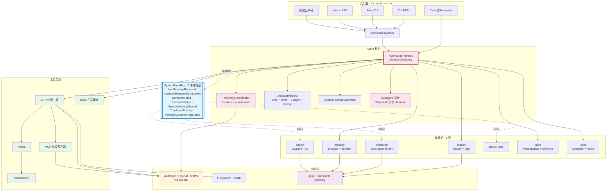

# jooj — Java Agent Harness

> 一个用 Java 实现的可扩展 AI Agent 运行时 —— Anthropic 协议直连 / Spring Boot 4 装配 / 多入口(CLI · Web · Weixin · Cron)/ 工具生态外挂(内置工具 + MCP + Skill)。


[English README](./README.md) · [架构深读](./EVOLUTION.md)

---

## 这是什么

**jooj 是一个完整的 LLM agent harness** —— 把「模型 + 工具 + 上下文 + 协作」装进一个 Java 进程,既能交互式跑(CLI / Web),也能后台调度(cron / weixin / teammate)。

核心能力:

- **Multi-turn Agent Loop** —— LLM 调工具、看结果、自我修正,直到任务完成
- **内置工具集** —— `bash` / `read_file` / `write_file` / `edit_file` / `glob` / `todo_write` / 任务管理 / cron / 团队通信 / git worktree 等十几种
- **MCP 协议外挂** —— `connect_mcp("filesystem")` 运行期连接外部 MCP server,新工具立即可用,不用重启
- **Skill 三层加载** —— 启动期扫描项目 / `~/.jooj/skills` / `~/.claude/skills`,catalog 注入 system prompt,LLM 按需 `load_skill(name)` 拉完整 body
- **持久 Memory** —— 跨 session 记住用户偏好、项目事实、参考资料(LLM 自动提取 + 索引)
- **多入口共享一个 harness** —— CLI/Web/Weixin/Cron 4 条入口都通过 `AgentLoopHarness.processOneQuery(sid, q)` 汇聚,行为一致

---

## 快速开始

### 1. 编译 & 启动

```bash
git clone <this-repo> && cd jooj
./mvnw -DskipTests=true package

# 启动 Web 模式(默认端口 8080)
java -jar target/jooj-0.0.1-SNAPSHOT.jar --web
```

**首次启动**:jooj 会自动建 `~/.jooj/.env` 模板文件(POSIX 0600,只有你能读),并提示打开它填 API key。

### 2. 配置 API key

打开 `~/.jooj/.env`,**解开注释填一组**(二选一):

```env
# 路径 1:Anthropic 官方
ANTHROPIC_API_KEY=sk-ant-...
MODEL_ID=claude-sonnet-4-6

# 路径 2:Anthropic 兼容代理(自建 / 公司 LLM 网关 / DeepSeek 等)
ANTHROPIC_AUTH_TOKEN=your-token
ANTHROPIC_BASE_URL=https://your-proxy.example.com
MODEL_ID=your-model-id
```

OS 环境变量优先级最高,也可以 `export ANTHROPIC_API_KEY=...` 直接跑。

### 3. 选一个入口跑

| 入口 | 启动方式 | 用途 |
|---|---|---|
| **Web UI** | `java -jar target/jooj-*.jar --web` → http://localhost:8080 | 浏览器聊天 + sidebar 看 Skill / Memory / 状态 |
| **CLI REPL** | `java -jar target/jooj-*.jar`(默认) | 简单文本 REPL |
| **Weixin** | 配 `jooj.weixin.*` 后走 `WeixinController` | 微信公众号被动回复 |
| **Cron** | 通过 `cron_schedule` 工具或 `~/.jooj/cron/scheduled_tasks.json` | 定时任务,后台跑 agent loop |

---

## 组件总览

代码根:`com.xilidou.jooj/`,按功能域平铺(不做深层次层次结构)。

25 个顶级包分 5 大功能簇 + 一条 Spring 事件总线:



### 入口层(4 条 channel)

| 包 | 关键类 | 作用 |
|---|---|---|
| `web/` | `ChatController` · `SidebarController` · `SessionController` | REST + 静态资源(index.html / app.js) |
| — | `JoojCliRunner` | CLI REPL(根目录) |
| `channel/` | `InboundDispatcher` · `MessageChannel` · `PresenterRegistry` · `AnswerParser` | 统一入站分发 · presenter 注册中心 |
| `weixin/` | `WeixinChannel` · `WeixinController` · `WeixinTool` | 微信公众号入口 + 主动推送工具 |
| `cron/` | `CronService` · `CronQueueProcessor` · `CronScheduler` | 定时任务调度 + durable store |

所有入口都通过 `InboundDispatcher`(web/CLI/weixin)或 `CronTurnOrchestrator`(cron)→ `AgentLoopHarness.processOneQuery(sid, q)` 汇聚。

### Agent 核心

| 包 | 关键类 | 作用 |
|---|---|---|
| `agent/` | `AgentLoopHarness` · `RecoveryCoordinator` · `BackgroundTaskManager` · `DefaultAgentControl` | 主循环 / 错误恢复 / 后台任务管理 |
| `subagent/` | `Subagent` · `Teammate` · `AutonomousIdle` | 同步 subagent(spawn 阻塞返 summary)+ 异步 teammate(daemon 存活 + 独立 inbox) |
| `team/` | `MessageBus` · `ProtocolRegistry` · `WorktreeService` | Teammate 间消息路由 · 协议注册 · git worktree 隔离 |

### 上下文子系统

| 包 | 关键类 | 作用 |
|---|---|---|
| `transcript/` | `TranscriptService` · `TurnEventStream` | s22 事件驱动 transcript(7 种事件 + Listeners) |
| `session/` | `SessionService` | Session 生命周期 · history 存取 |
| `compact/` | `CompactPipeline` | 上下文压缩(超长历史触发) |
| `memory/` | `MemoryService` · LLM extractor | 跨 session 持久 memory + 索引 |
| `prompt/` | `SystemPromptAssembler` | System prompt 片段化组装 + ephemeral cache |

### 工具生态

| 包 | 关键类 | 作用 |
|---|---|---|
| `tool/` | `Tool` · `ToolRegistry` · `tool/impl/*Tool` | 内置工具接口 + 十几种实现 |
| `mcp/` | `McpRegistry` · `McpClient` · `SdkStdioMcpTransport` · `McpProxyTool` | 外挂 MCP server(stdio + mock 双 transport) |
| `skill/` | `SkillRegistry` · `LoadSkillTool` | 三层 skill 加载(项目 / ~/.jooj / ~/.claude) |
| `slashcmd/` | `SlashCommandRegistry` · `slashcmd/impl/*` | Slash 命令(`/clear` `/help` 等) |
| `permission/` | `PermissionPipeline` | 工具权限(rule-based + CLI prompt) |
| `hook/` | `HookManager` · `hook/impl/*` | Lifecycle hooks(PreToolUse / PostToolUse / Metrics) |
| `tasks/` | `TaskService` · `TasksTool` | Task 系统(create / claim / complete) |
| `todo/` | `TodoStore` · `TodoTool` | TodoWrite 工具 |
| `search/` | `SearchService` | 全文搜索工具后端 |

### 基础设施

| 包 | 关键类 | 作用 |
|---|---|---|
| `http/` | `AnthropicClient` · `AnthropicHttpClient` · `ModelRouter` · `AnthropicProperties` · `DeepSeekProperties` | Anthropic 协议 OkHttp 直连 + 多 provider 路由 |
| `llm/` | LLM 领域抽象 | 供应商无关的 LLM 域模型(P2 vendor-neutral) |
| `config/` | `JoojExecutors` · `JsonMappers` · `ConcurrencyProperties` | 跨域配置 / Bean 装配 |
| `bootstrap/` | `JoojEnvBootstrap` | `EnvironmentPostProcessor`,启动期建 `~/.jooj/.env` |

---

## 使用手册

### 装 Skill

jooj 兼容 [vercel-labs/skills](https://github.com/vercel-labs/skills) CLI 生态。任何 SKILL.md 风格的 skill 都能用:

```bash
# 用 npx 装一个全局 skill(到 ~/.claude/skills/,jooj 自动扫描)
npx skills add vercel-labs/skills --skill find-skills -g

# 或手动放到用户级
mkdir -p ~/.jooj/skills/my-skill
cat > ~/.jooj/skills/my-skill/SKILL.md <<'EOF'
---
name: my-skill
description: 我自己写的 skill
---
# Skill body...
EOF
```

**装完不需要重启** —— Web sidebar 点 ↻ 立即生效,或下一轮对话自动重扫(节流 1s)。

**三层优先级**(同名覆盖):

```
<cwd>/skills/         ← 项目专属(进 git,团队共享)       优先级最高
~/.jooj/skills/       ← jooj 用户级(个人偏好)
~/.claude/skills/     ← Claude Code 共享池(npx 装这里)   优先级最低
```

### 接 MCP Server

jooj 内置 [MCP](https://modelcontextprotocol.io) 客户端。LLM 在对话中调 `connect_mcp("filesystem")` 就能连 stdio 子进程,自动发现该 server 的全部工具,以 `mcp__filesystem__read` 之类的前缀名暴露给 LLM。

在 `application.yml` 或 `application-local.yml` 里配:

```yaml
jooj:
  mcp:
    servers:
      filesystem:
        command: npx
        args: ["-y", "@modelcontextprotocol/server-filesystem", "/Users/me/projects"]
      git:
        command: npx
        args: ["-y", "@modelcontextprotocol/server-git", "--repo", "."]
```

未在 yml 配置的 server 名(如 `docs` / `deploy`)走内置 mock —— 教学演示,不需要真起子进程。

### REST API(Web 模式)

**对话** (`ChatController`):

| Endpoint | 作用 |
|---|---|
| `POST /api/chat` | 喂一条 query,跑一轮 agent loop,返 reply / historySize / 本轮 toolCalls |
| `GET /api/history` | 完整对话历史(role + 揉平 text) |
| `POST /api/clear` | 清空 history |

**Sidebar 只读** (`SidebarController`):

| Endpoint | 作用 |
|---|---|
| `GET /api/skills` | Skill 概要列表(name + description,不含 body) |
| `POST /api/skills/rescan` | 强制重扫 skill 目录 |
| `GET /api/memory` | Memory catalog(markdown) |
| `GET /api/status` | 运行时状态(model / cwd / 工具数 / skill 数 / cron / memory 字数) |

**Session** (`SessionController`):列出 / 切换 / 删除 session。

### CLI 调试参数

```bash
# 看 Anthropic HTTP 请求/响应正文
./mvnw spring-boot:run -Dspring-boot.run.jvmArguments="-Dlogging.level.com.xilidou.jooj.http=DEBUG"

# 看每次工具调用的完整 input(默认只 preview 60 字)
./mvnw spring-boot:run -Dspring-boot.run.jvmArguments="-Dlogging.level.com.xilidou.jooj.hook=DEBUG"

# 换端口(默认 8080 被占)
./mvnw spring-boot:run -Dspring-boot.run.jvmArguments="-Dserver.port=8090"
```

### 测试

```bash
./mvnw test
```

按包覆盖:agent / channel / compact / cron / hook / http / mcp / memory / permission / prompt / session / skill / slashcmd / subagent / tasks / team / todo / tool / transcript / web / weixin / bootstrap —— 几乎每个包都有专门测试类。

---

## 文件布局(用户视角)

```
~/.jooj/                          ← 用户级 jooj 数据(0700)
├── .env                          ← API key / model 配置(0600,首次启动自动建模板)
├── cron/
│   └── scheduled_tasks.json      ← durable cron job(jooj 重启恢复)
└── skills/                       ← 用户级 skill(可选,跨项目共享)

<project>/                        ← 当前 jooj 项目目录
├── .memory/                      ← 项目级 memory(MEMORY.md 索引 + 每条 .md 正文)
├── .tasks/                       ← 项目级 task 列表
├── .mailboxes/                   ← teammate 通信文件邮箱
├── .transcripts/                 ← session 录像
├── .task_outputs/                ← 大 tool result 落盘
├── .worktrees/                   ← s18 git worktree 隔离
└── skills/                       ← 项目级 skill(进 git,团队共享)
```

**用户级 vs 项目级**:secret / 跨项目共享的能力 → `~/.jooj/`;跟"这个项目里跑的这次工作"绑定的状态(memory / tasks / 团队通信)→ cwd。

---

## 关键设计原则

| 原则 | 说明 |
|---|---|
| **多入口共享一个 harness** | 4 条 channel(CLI/Web/Weixin/Cron)全走 `AgentLoopHarness.processOneQuery(sid, q)` |
| **Anthropic 直连** | OkHttp + 自写 DTO,不依赖官方 SDK,协议透明 |
| **Spring Boot 4 装配** | 所有组件 `@Component`,工具/钩子/skill 自动发现 |
| **事件驱动 transcript** | s22 起用 7 种事件 + Listeners 解耦,历史原文不被压缩摧毁 |
| **接口隔离外部依赖** | `McpTransport` `GitClient` 等接口 + 多实现,易测试易替换 |
| **路径分离** | secret / 跨项目共享 → `~/.jooj/`;项目状态 → cwd |

---

## 技术栈

| 类别 | 选择 |
|---|---|
| Java | JDK 17+ |
| 框架 | Spring Boot 4.1.0 |
| HTTP | OkHttp 5.4.0(`okhttp-jvm`,避开 KMP 主 jar 空陷阱) |
| JSON | Jackson 2.18.2(显式锁定,不用 Boot 默认 3.x) |
| MCP | 官方 Java SDK 2.0.0 |
| 日志 | SLF4J + Logback |
| 测试 | JUnit 5 + Mockito + AssertJ |

---

## 相关链接

- [shareAI-lab/learn-claude-code](https://github.com/shareAI-lab/learn-claude-code) — 学习教材(Python 版)
- [Anthropic Messages API](https://docs.anthropic.com/en/api/messages) — 协议参考
- [Model Context Protocol](https://modelcontextprotocol.io) — MCP 规范
- [vercel-labs/skills](https://github.com/vercel-labs/skills) — Skill 包管理 CLI

---

## License

[WTFPL](./LICENSE) —— Do What The Fuck You Want To Public License, v2。

一句话:**想干啥就干啥。**
